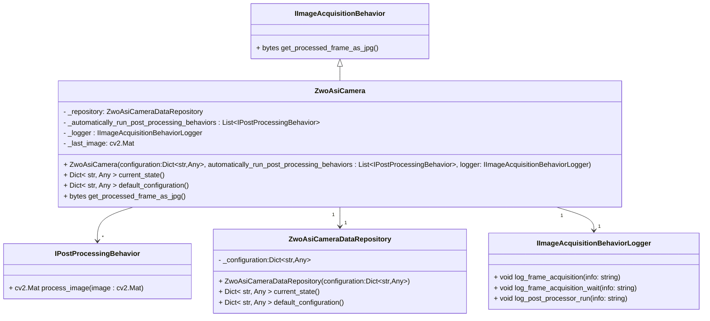
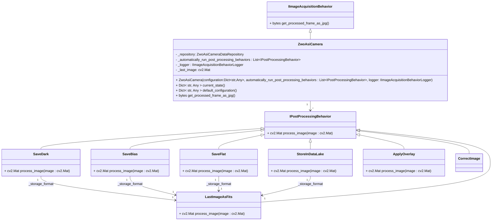
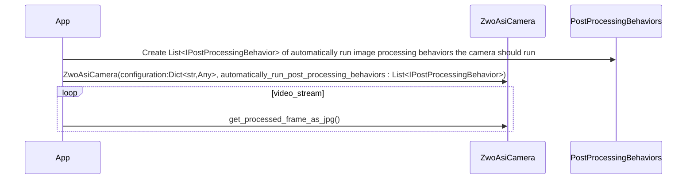
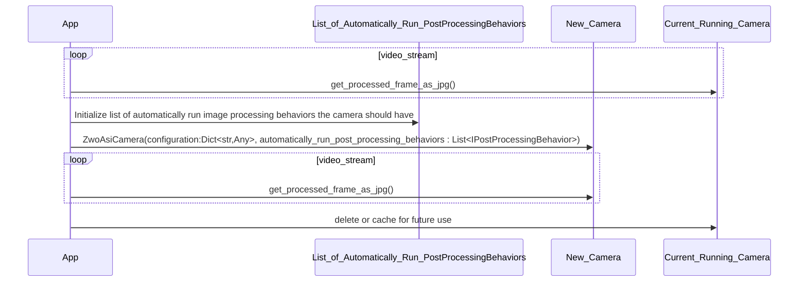
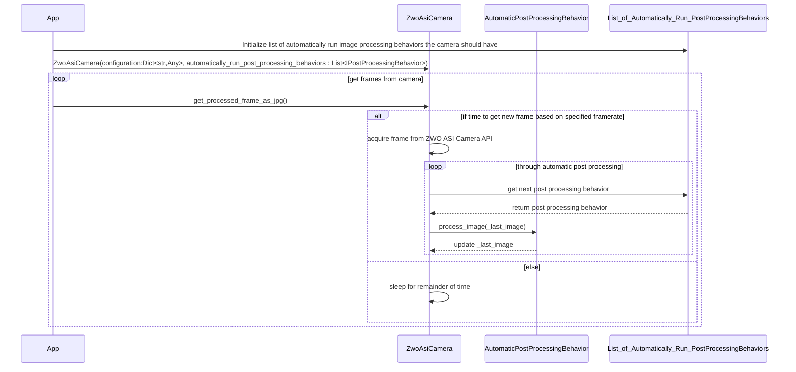

# ZwoAsiCamera

Class structure directly associated with the ZWO ASI Camera.

Classes associated with the ZWO ASI Camera that can be used to optionally extend the functionality of the ZWO ASI Camera.

## Camera Initialization

This section goes through the recommended sequence of steps to initialize a camera instance assuming no other camera is running on the same port.

### Change Camera Settings

A configuration based approach assumes that settings are not directly modified by the user, once the camera instance is created. The settings may be indirectly modified by the user through operating a function. To apply new settings you create a new instance of the camera and replace the existing instance of the camera (see sequence diagram below).

It is then up to the application to decide to release what was the currently running camera or hold it for later use.

#### Positives of this approach

1. Smaller interface footprint. This helps in keeping the interfaces more stable. This has a direct impact on automated testing.
2. Less issues with intermediary transitions of the settings. This has an impact on special coding checks and automated testing. Less chance of getting into an unexpected state because of issues like assertions.
3. Since changing settings is about bringing a new camera instance into existence, you are also insuring the currently running camera can be halted so the new camera instance can be started. This has an impact in automated testing.

#### Negatives of this approach

1. You must reinitialize a new camera instance to apply new settings. If initialization takes a degree of time, you may want to have a cache of cameras with the various settings and just switch the camera to change the active one. This is similar to multiple buffering of screen buffers used in traditional graphics programming. The classic trade-off of memory vs performance.
2. Because injection of things like post processing behaviors are typically part of the initialization, variations in the post processing behavior requires initialization of a new camera instance.

### Typical Image Processing Flow

This sequence describes a typical image processing flow.  The camera is initialized with a frame rate. The primary purpose of the framerate is to keep a camera from reporting at a faster rate then the one specified, thus controlling the process load on the CPU. A typical framerate of 22 fps appears as realtime to the user.

It is important to note the post processing performance can drive the rate slower. If you need to get it to run at the specified rate you should consider writing the post processor to run asynchronously and prevent running the handler multiple times at once.

The camera will have a last image object that changes only after the entire processing sequence is run. To see intermediate images in the processing sequence have an automated processor export it out.

