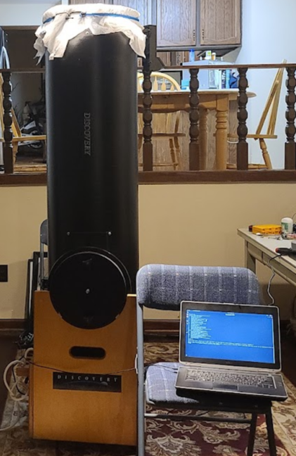

The telescope is very similar to the [15" PDHQ f/4.2](http://www.discoverytelescope.com/discovery/pdhq.html),  The primary difference is it was made before Discovery made the Split-Tube Design. The Optical Tube Assembly (OTA) is a single tube.

## f/4.2 Specifications

* primary mirror: 15" x 2"c.t.
* secondary mirror: 3.5" minor axis
* focal length: 63" (1600mm)
* tube length: 67"
* tube diameter: 16"
* eye piece height: 62"
* tube wt.: 86 lbs
* mount weight: 34 lbs
* mount dimensions: 20"x18" D x 25.5" H

As you can see the tube is not trivial to move around. It weighs in and 120 lbs. I use a two wheel dolly. Though the tube is nicely balanced it is still a significant mass so static friction is still a problem to overcome.

The scope because it was designed for manual usage uses teflon and formica laminate to reduce friction.

Silicon spray lubricant works quite well to lower that fiction more, but that increases a maintenance step and too much makes the azimuth unstable. It is designed that the static friction hold the azimuth in place.

Use of a hold current for Azimuth is required to counter acceleration for stepper motor usage. Determination of that hold current with be determined experimentally.

We want the minimal hold current to reduce the amount of energy. It may be that the hold current is non-linear and related the azimuth angle.
